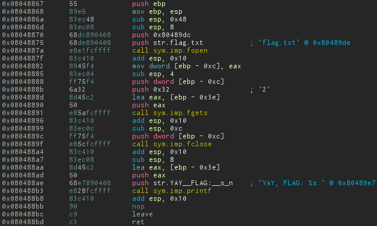
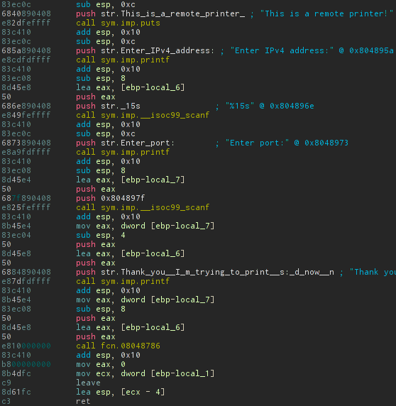
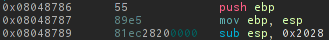
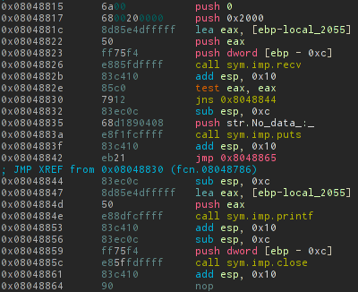

### Exploitation 80

>Description: Printer are very very important for offices. Especially for remote printing. My boss told me to build a tool for that task.
>[RemotePrinter](./RemotePrinter)

**Strings** util find "YAY, FLAG: %s.". So by looking into the binary we can find that function:

Ok so we probably should call this function somehow manualy because it doesn't call explicitly. So let's analyze the code.

Brief overview of the main function give us info about that it gets IP&port and after that perform some function fcn.08048786. Btw by launching remote server we can understand that default stdin/out redirected to the network.

The quick overview of binary also gets 

The notable thing it allocates 0x2028 for local variables. After it just connects to specified server's IP&port(next - printer) by default unix sockets.

Here it goes the interesting part. Server receive from printer 0x2000 bytes, so due it allocates much more we cannot perform [overflow of the stack](https://en.wikipedia.org/wiki/Buffer_overflow).
The second interesting part is transfering received buffer directly to printf. Aha! Here we can use format specifiers!
Let's test it! After testing server with bunch of %d we can understand that first number is buffer address(you can understand it from the code actually), buffer size, four empty values and our buffer, something like that:

So we can exploit by writing at first 4 bytes return address, and write to that address value of function that print flags. We can do it with %n specifier. The last unanswered question is how to get address of return-eip. It can be easily calculated to the buffer address and that we've already got. **0xffffbcec + 0x2020 = 0xffffdd0c**.
So our exploit is "\x0c\xdd\xff\xff%d%d%d%d%d%134514775d%n" (actually you can use parameter field of posix extension, it also should work).
In the end of output we get our flag: **YAY, FLAG: IW{YVO_F0RmaTt3d_RMT_Pr1nT3R}**
