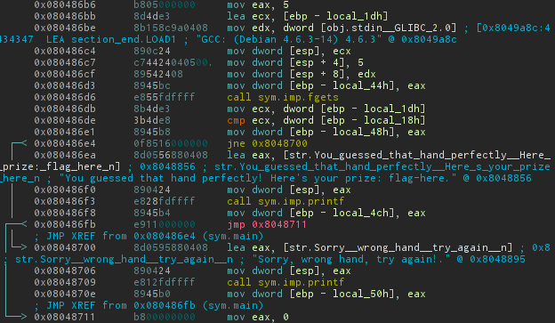

By running binary we can see strange symbols at debug info and they actually change every launch
>./randy_noflag 
>Welcome to Randy's TinyPoker! DebugInfo: g�[
>We've dealt you your hand face down, please enter it:

Ok, let's dive into the binary. We can see that that string was changed its from:
>Welcome to Randy's TinyPoker! DebugInfo: AAAA

It adds to each byte of the string (at "AAAA") corresponding byte from received random string:


It's quite big piece of code, but actually its logic is as simple as this pseudocode:
```python
r = rand()
s = "Welcome to Randy's TinyPoker! DebugInfo: AAAA"
l = s.find('AAAA')

for i in range(5):
    a = r >> (24 - 8 * i)
    s[l+i] = (s[l+i] + a) % 256

```
Further we see such block:


So here we simple need to enter the value that equals to local_18h. If we look in first screenshot of code we see that it returned value of random function.

So it's very easy to see that we can [produce](./randy.py) reverse function for retrieving produced random value and receive our flag:

Ehm, I forgot to save it, so we'll be glad to receive PR for fixing this line :)

Note: I guess it's actually can work by simple bruteforcing that value due to we know the seed of rand
